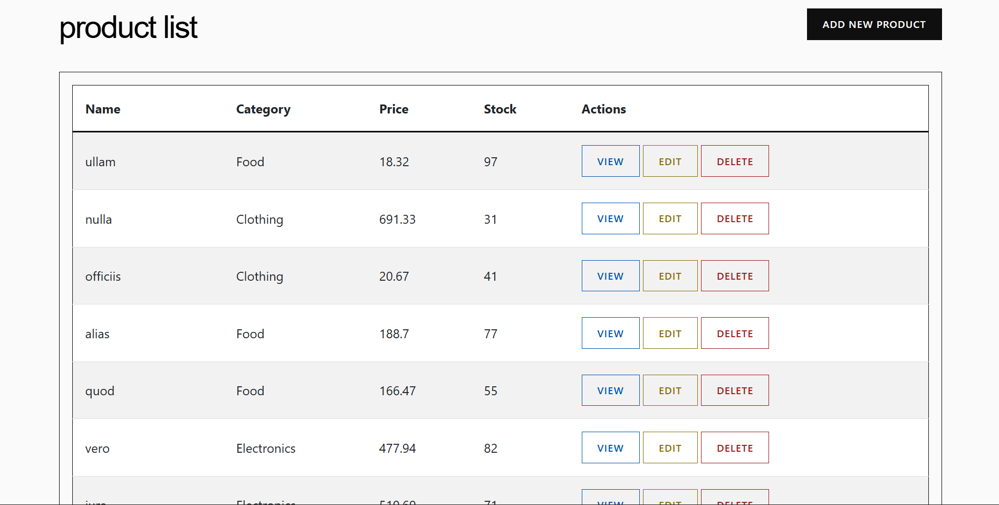
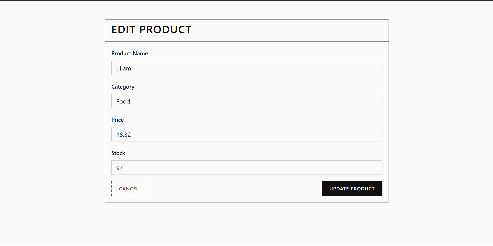
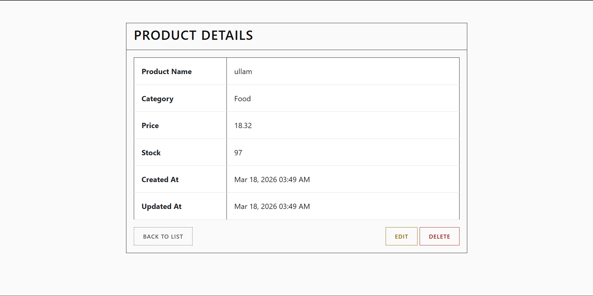

# Product Management System (product-ms)

## Overview

**Product Management System (product-ms)** is a simple CRUD web application built with **Laravel** and **Bootstrap**.
The system allows users to manage an inventory or catalog by performing the following operations:

* Create new product records
* View product details
* Update existing product information
* Delete products from the system

This project demonstrates the implementation of **basic CRUD functionality**, database interaction, and clean UI styling.

---

## Features

* Add new products to the database
* View a list of all products
* View detailed information about a specific product
* Edit product information
* Delete products
* Pagination support for product listings
* Clean, minimalistic user interface styling

---

## Database Table Fields

The system uses a **products** table with the following fields:

| Field Name     | Type      | Description                         |
| -------------- | --------- | ----------------------------------- |
| id             | bigint    | Primary key                         |
| product_code   | string    | Unique SKU or code identifier       |
| name           | string    | Name of the product                 |
| description    | text      | Detailed description of the product |
| category       | string    | Category or department              |
| price          | decimal   | Selling price of the product        |
| stock          | integer   | Available inventory count           |
| created_at     | timestamp | Record creation timestamp           |
| updated_at     | timestamp | Last update timestamp               |

---

## CRUD Operations

The system implements the following CRUD operations:

### Create

Users can add a new product by filling out the **Add New Product** form.

### Read

Users can:

* View a list of all products
* View detailed information about a specific product

### Update

Users can modify existing product records through the **Edit Product** page.

### Delete

Users can remove products from the database with a confirmation prompt.

---

## Screenshots

### Products List

### Create Product

### Edit Product

### View Product

---

## Technologies Used

* Laravel
* PHP
* MySQL
* Bootstrap 5
* HTML / CSS

---

## Author

Developed as part of a **CRUD application project** demonstrating database operations and Laravel framework fundamentals..